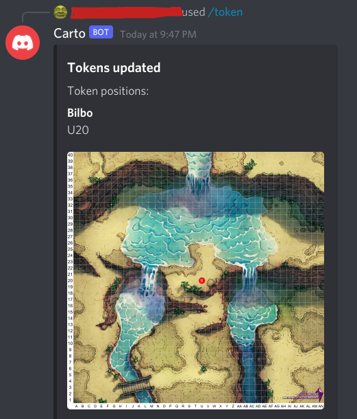
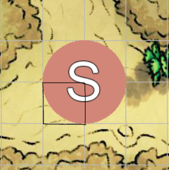
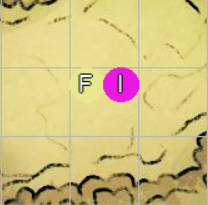
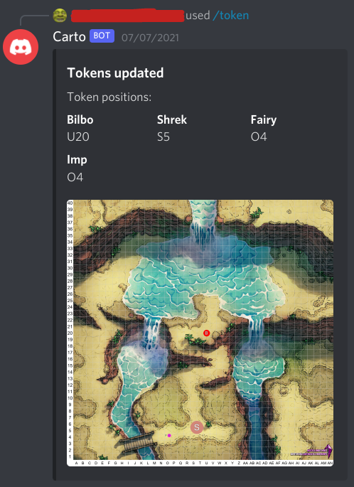
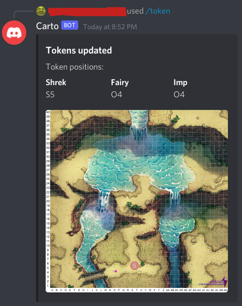

# Token Commands

{: .no_toc }

<details open markdown="block">
  <summary>
    Table of contents
  </summary>
  {: .text-delta }
1. TOC
{:toc}
</details>

## [](#add)Add a new Token

```
/token add name: Bilbo row: 20 column: U colour: red size: Small
```

Adds a Token to the Map on this channel, at the position determined by the numerical `row`, and the alphabetical `column`. Each token must have a unique name, as this is how you will interact with them further.
If a Map does not exist on the channel you post this command, an error message will be displayed and the Token will not be added.

**Parameters**

| Name     | Required | Notes                                                                                                                                                                                                                            |
| :------- | :------- | :------------------------------------------------------------------------------------------------------------------------------------------------------------------------------------------------------------------------------- |
| `name`   | Yes      | The unique name for this Token                                                                                                                                                                                                   |
| `row`    | Yes      | The row **number** upon which to place the Token                                                                                                                                                                                 |
| `column` | Yes      | The column **letter** upon which to place to Token                                                                                                                                                                               |
| `colour` | No       | The colour to make the token. If this is omitted, a colour will be chosen for you. You may either choose a [common css colour](https://www.w3schools.com/colors/colors_names.asp) or provide a specific hex value (e.g. #e5e5e5) |
| `size`   | No       | The size of the token. This is `Medium` by default, and uses the sizes provided in the [D&D Basic Rules](https://www.dndbeyond.com/sources/basic-rules/monsters#Size). Discord will prompt you to choose a size from a list.     |

**Example**

```
/token add name: Bilbo row: 20 column: U colour: red size: Small
```



### A note on Token sizes

Small and Medium Tokens will take up one space on the square provided in the command.

Tokens of size Large or larger will have the left hand corner of their occupied space be the space you picked. For example, a Large Token created at the space `S5` (marked in black) on the example map would look like this:



Tokens of size Tiny can stack on the same square up to 4 times without overlapping. Note that a 5th Tiny Token on the same square will not cause an error, however the newest Token **will overlap with the 1st one**.
For example, 2 Tiny Tokens created at the space `O4` on the example map would look like this:



## [](#move)Move a Token

```
/token move name: Bilbo row: 26 column: V
```

Moves a Token on the Map to the position determined by the numerical `row`, and the alphabetical `column`. The Token specified by the provided `name` must exist on the map, otherwise an appropriate error message will be displayed.

**Parameters**

| Name     | Required | Notes                                             |
| :------- | :------- | :------------------------------------------------ |
| `name`   | Yes      | The name of the Token to move                     |
| `row`    | Yes      | The row **number** upon which to move the Token   |
| `column` | Yes      | The column **letter** upon which to move to Token |

**Example**

```
/token move name: Bilbo row: 26 column: V
```

Before the move, the Map looks like this  


After the command, the Token `Bilbo` is moved from U20 to V26  


## [](#delete)Delete Tokens

```
/token delete name: Bilbo
```

Deletes a names Token from the Map, or all Tokens. The Token specified by the provided `name` must exist on the map, otherwise an appropriate error message will be displayed.

**Parameters**

| Name   | Required | Notes                           |
| :----- | :------- | :------------------------------ |
| `name` | No       | The name of the Token to delete |
| `all`  | No       | Whether to delete all Tokens    |

**Example**

```
/token delete name: Bilbo
```

Before the deletion, the Map looks like this  


After the command, the Token `Bilbo` is deleted from the map. This is reflected in the summary above the image.  

