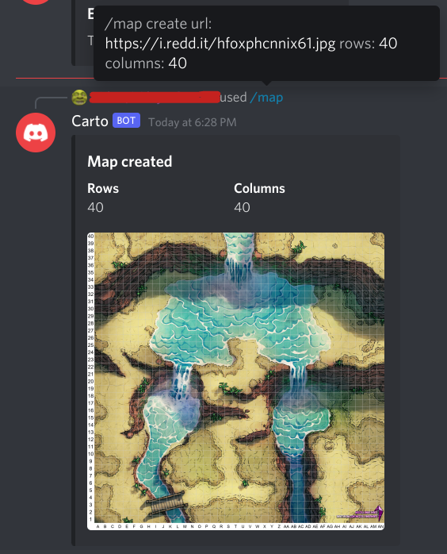
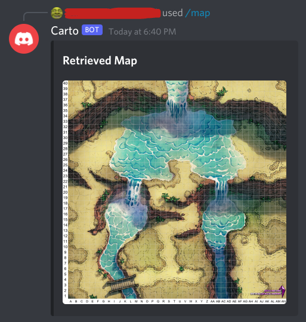
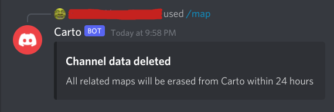

# Map Commands

{: .no_toc }

<details open markdown="block">
  <summary>
    Table of contents
  </summary>
  {: .text-delta }
1. TOC
{:toc}
</details>

## [](#create)Create a new Map

```
/map create url: https://my.image-site.com/map.png rows: 10 columns: 15
```

If a Map already exists on the channel you post this command, that Map will be overwritten with the newly created one.
An invalid image URL will result in an error message being returned instead of a Map. If this is the case, previous Maps will _not_ be overwritten. For best results, consider uploading any images to an image sharing site, such as [imgur](imgur.com), so you can link directly to the image.

**Parameters**

| Name      | Required | Notes                                                                 |
| :-------- | :------- | :-------------------------------------------------------------------- |
| `url`     | Yes      | Must be a direct image link. Google Drive links do not currently work |
| `rows`    | Yes      | The number of rows the grid should have                               |
| `columns` | Yes      | The number of columns the grid should have                            |

**Example**

```
/map create url: https://i.redd.it/hfoxphcnnix61.jpg rows: 40 columns: 40
```



## [](#get)Display the current channel Map

```
/map get
```

The latest created Map will be shown. If no Map has been created, an appropriate error message will be displayed.

**Example**

```
/map get
```



## [](#delete)Delete the current channel Map

```
/map delete
```

All Map data for this channel will be deleted, including historical Map data, instantly. This is the equivalent action to deleting the channel in Discord, which will trigger the deletion of all associated content within 24 hours.

**Example**

```
/map delete
```


